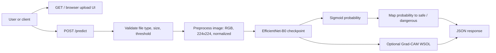

# Opened Manhole Classifier

## One-line summary

Inference-only computer vision service that classifies street manhole images as `safe` (closed) or `dangerous` (open/damaged), with optional Grad-CAM localization output.

## Demo

The application provides both a browser upload UI and a REST API.

**Hosted demo:** not currently documented in this repository. The project is configured for Docker-based deployment and can be deployed to Hugging Face Spaces or another container host.

### Browser UI

Run the app locally, then open:

```text
http://localhost:7860/
```

Upload a JPG/PNG image, choose a classification threshold, optionally enable WSOL, and submit the image to view the JSON response.

### API

Health check:

```bash
curl http://localhost:7860/health
```

Class-only prediction:

```bash
curl -X POST http://localhost:7860/predict \
  -F "file=@/path/to/image.jpg" \
  -F "threshold=0.5" \
  -F "include_wsol=false" \
  -F "cam_threshold=0.05"
```

Prediction with WSOL/Grad-CAM bounding box:

```bash
curl -X POST http://localhost:7860/predict \
  -F "file=@/path/to/image.jpg" \
  -F "threshold=0.5" \
  -F "include_wsol=true" \
  -F "cam_threshold=0.05"
```

Example response:

```json
{
  "label": "safe",
  "confidence": 0.91,
  "prob_safe": 0.91,
  "prob_dangerous": 0.09,
  "threshold": 0.5,
  "wsol": {
    "cam_threshold": 0.05,
    "bbox": {
      "pixel": {
        "x_min": 10,
        "y_min": 20,
        "x_max": 100,
        "y_max": 120,
        "width": 90,
        "height": 100
      },
      "normalized": {
        "x": 0.04,
        "y": 0.09,
        "width": 0.40,
        "height": 0.45
      }
    }
  }
}
```

## Screenshots

No screenshots are currently committed to the repository.

Recommended screenshots to add:

- Browser upload interface
- Class-only prediction response
- Prediction response with WSOL/Grad-CAM bounding box enabled

Suggested paths:

```markdown


```

## Problem

Open or damaged manholes can create serious safety risks for pedestrians, cyclists, and vehicles. Manual inspection is slow and difficult to scale across many street-level images or field reports.

The goal of this project is to provide a lightweight image-classification service that can quickly flag whether a photographed manhole appears closed and safe or open/damaged and dangerous.

## Solution

The project serves a fine-tuned EfficientNet-B0 binary classifier behind a FastAPI application.

The service accepts a JPG/PNG image, preprocesses it to the model input format, runs inference, and returns:

- final label: `safe` or `dangerous`
- confidence score
- `prob_safe`
- `prob_dangerous`
- decision threshold used for classification
- optional WSOL output using Grad-CAM, returned as a bounding box

The app is inference-only: training notebooks and dataset handling are kept outside the runtime path so the deployed service remains small, focused, and easier to operate.

## Tech stack

| Area | Tools |
|---|---|
| Language | Python |
| API | FastAPI, Uvicorn |
| Model serving | PyTorch, TorchVision |
| Model architecture | EfficientNet-B0 with a one-logit binary classifier head |
| Image processing | Pillow, OpenCV, NumPy |
| Explainability / WSOL | Grad-CAM |
| Validation / schemas | Pydantic |
| Tests | pytest, FastAPI TestClient, httpx |
| Packaging / deployment | Docker, Hugging Face Spaces-compatible Docker configuration |

## Architecture



Runtime components:

```text
app/
  main.py         # FastAPI app, routes, validation, error handling
  inference.py    # Predictor wrapper, sigmoid mapping, optional Grad-CAM WSOL
  model.py        # EfficientNet-B0 architecture and checkpoint loading
  preprocess.py   # Image resizing, tensor conversion, normalization
  schemas.py      # Pydantic response and error schemas

tests/
  test_api.py
  test_inference.py
  test_preprocess.py

data/
  README.md       # Dataset access notes; dataset is not stored in the repo

results/
  README.md       # Placeholder for experimental results and models
```

Core endpoints:

| Endpoint | Method | Purpose |
|---|---:|---|
| `/` | `GET` | Browser upload demo UI |
| `/health` | `GET` | Service and model-load status |
| `/predict` | `POST` | Image classification with optional WSOL output |

Classification mapping:

| Model output | Public label |
|---|---|
| `sigmoid(logit) > threshold` | `safe` |
| `sigmoid(logit) <= threshold` | `dangerous` |

## How to run locally

### 1. Create a virtual environment

```bash
python -m venv .venv
source .venv/bin/activate
pip install -r requirements.txt
```

For Windows PowerShell:

```powershell
python -m venv .venv
.\.venv\Scripts\Activate.ps1
pip install -r requirements.txt
```

### 2. Start the app in mock mode

Mock mode is useful for testing the UI and API without loading the real model checkpoint.

```bash
USE_MOCK_PREDICTOR=1 uvicorn app.main:app --host 0.0.0.0 --port 7860
```

### 3. Start the app with the real model

The real model expects `b0_v2.pth` in the repository root by default.

```bash
uvicorn app.main:app --host 0.0.0.0 --port 7860
```

Then open:

```text
http://localhost:7860/
```

Health check:

```text
http://localhost:7860/health
```

If `/health` returns `"model_loaded": false`, check that the model checkpoint exists and that `MODEL_PATH` points to the correct file.

### 4. Optional Docker run

Build the image:

```bash
docker build -t opened-manhole-classifier:local .
```

Run with the real model:

```bash
docker run --rm -p 7860:7860 opened-manhole-classifier:local
```

Run in mock mode:

```bash
docker run --rm -p 7860:7860 \
  -e USE_MOCK_PREDICTOR=1 \
  opened-manhole-classifier:local
```

### Environment variables

| Variable | Default | Purpose |
|---|---:|---|
| `MODEL_PATH` | `b0_v2.pth` | Path to the model checkpoint |
| `MAX_IMAGE_BYTES` | `8388608` | Maximum upload size; default is 8 MB |
| `DISABLE_STARTUP_MODEL_LOAD` | `0` | Skip model loading during startup, useful for tests |
| `USE_MOCK_PREDICTOR` | `0` | Set to `1` to run deterministic mock predictions |

## Tests

Run the test suite:

```bash
pytest -q
```

Current test coverage includes:

- preprocessing output shape, dtype, and normalized range
- label mapping from sigmoid probability to `safe` / `dangerous`
- Grad-CAM bounding-box fallback when no contour is found
- API health endpoint behavior
- API prediction behavior with and without WSOL
- API error handling for unsupported file types and invalid thresholds

## Key technical decisions

- **Inference-only runtime:** training artifacts are excluded from the serving path to keep deployment simpler and more reliable.
- **EfficientNet-B0 backbone:** provides a compact CNN architecture suitable for CPU-friendly image classification demos.
- **One-logit binary classifier:** the model emits a single sigmoid probability for the `safe` class, simplifying output interpretation.
- **Configurable threshold:** callers can tune the `safe` / `dangerous` decision boundary at request time.
- **Locked label mapping:** `safe` and `dangerous` are mapped explicitly to avoid ambiguity during deployment.
- **Notebook-matching preprocessing:** images are resized to `224x224` and normalized with mean/std values of `0.5`.
- **Optional WSOL:** Grad-CAM is available when interpretability is useful, but it can be disabled for faster CPU inference.
- **Structured error responses:** API failures return consistent JSON payloads with machine-readable error codes.
- **Mock predictor:** local UI/API testing can run without model weights or GPU access.
- **Docker-first deployment:** the app can run consistently locally, in Hugging Face Spaces, or on another container platform.

## Results / metrics

Current repository status:

| Category | Status |
|---|---|
| API functionality | Implemented |
| Browser upload UI | Implemented |
| Docker deployment path | Implemented |
| Mock inference mode | Implemented |
| Optional Grad-CAM WSOL | Implemented |
| Automated tests | Implemented |
| Public hosted demo URL | Not documented yet |
| Screenshots | Not committed yet |
| Validation accuracy / precision / recall / F1 | Not documented yet |
| Latency benchmark | Not documented yet |

Recommended metrics to add before using this as a polished portfolio project:

- validation accuracy
- precision, recall, and F1 for the `dangerous` class
- confusion matrix
- ROC-AUC or PR-AUC
- CPU inference latency with and without WSOL
- dataset size and class balance

## Limitations

- The training dataset is not stored in the repository; access is documented separately in `data/README.md`.
- Public model evaluation metrics are not currently documented.
- The classifier is binary and does not distinguish between different types of manhole damage.
- WSOL output is Grad-CAM-based explainability, not a supervised object detector or segmentation model.
- CPU inference is suitable for demos, but WSOL can be slower than class-only prediction.
- The current API handles one image per request; batch inference is not implemented.
- The model should be validated on new geography, lighting, weather, camera angle, and road-surface conditions before operational use.

## Roadmap

- Add screenshots of the upload UI and prediction outputs.
- Add a public hosted demo URL.
- Publish validation metrics, confusion matrix, and latency benchmarks.
- Add CI to run tests automatically on pull requests.
- Add a model card covering dataset scope, intended use, and known failure modes.
- Add sample images for safe and dangerous predictions if licensing allows.
- Add batch inference support.
- Add request logging and basic monitoring for deployment.
- Evaluate model export options such as ONNX for faster CPU inference.
- Add threshold-selection guidance based on validation-set performance.

## My role

I productionized the project into an inference-only computer vision service: implemented the FastAPI serving layer, model-loading path, preprocessing pipeline, prediction response schema, optional Grad-CAM WSOL output, Docker deployment setup, mock inference mode, and automated tests for the critic
::contentReference[oaicite:1]{index=1}
al API and inference paths.
